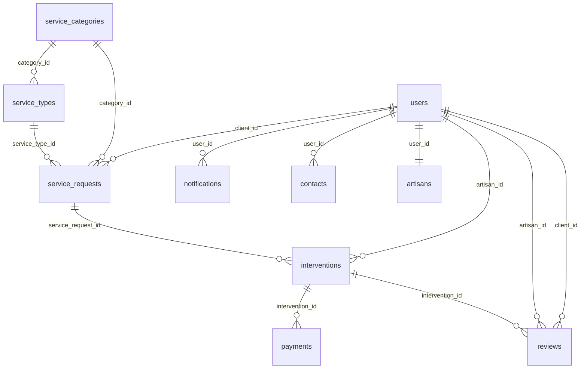

# 📊 Base de Données FixyHome - Documentation Complète

## 🎯 Vue d'ensemble

Ce dossier contient la structure complète de la base de données pour le projet **FixyHome**, une plateforme de mise en relation entre clients et artisans.

## 📁 Fichiers Disponibles

### 1. `fixyhome_database_complete.sql`
- **Description** : Script complet de création de la base de données
- **Contenu** : Tables, index, triggers, vues, fonctions
- **Utilisation** : À exécuter en premier pour créer toute la structure

### 2. `fixyhome_sample_data.sql`
- **Description** : Données d'exemple pour tester l'application
- **Contenu** : Utilisateurs, artisans, services, demandes, interventions, etc.
- **Utilisation** : À exécuter après la création des tables

## 🏗️ Architecture de la Base de Données

### Tables Principales

#### 👥 **Gestion des Utilisateurs**
- **`users`** : Utilisateurs du système (clients, artisans, admins)
- **`user_sessions`** : Sessions actives et tokens JWT

#### 🔧 **Gestion des Services**
- **`service_categories`** : Catégories principales (Plomberie, Électricité, etc.)
- **`service_types`** : Types spécifiques de services dans chaque catégorie

#### 📋 **Gestion des Demandes**
- **`service_requests`** : Demandes de service créées par les clients
- **`interventions`** : Interventions planifiées et réalisées

#### 💰 **Gestion Financière**
- **`payments`** : Paiements associés aux interventions

#### ⭐ **Gestion des Avis**
- **`reviews`** : Évaluations et commentaires des clients

#### 🔔 **Gestion des Notifications**
- **`notifications`** : Notifications système pour les utilisateurs

#### 📞 **Gestion des Contacts**
- **`contacts`** : Demandes de contact depuis le formulaire

#### 👨‍🔧 **Profils Spécifiques**
- **`artisans`** : Profils détaillés des artisans avec compétences

## 🔄 Relations et Flux



## 🚀 Instructions d'Installation

### Étape 1 : Création de la base avec encodage UTF-8
```sql
-- Se connecter à PostgreSQL
psql -U postgres

-- Créer la base de données avec encodage UTF-8
CREATE DATABASE fixyhome WITH ENCODING 'UTF8';

-- Se connecter à la base
\c fixyhome
```

### Étape 2 : Exécution du script principal
```bash
# Exécuter le script de création
psql -U postgres -d fixyhome -f fixyhome_database_complete.sql
```

### Étape 3 : Insertion des données d'exemple
```bash
# Exécuter le script de données
psql -U postgres -d fixyhome -f fixyhome_sample_data.sql
```

## 📊 Types de Données

### Types Énumérés
- **`user_type`** : CLIENT, ARTISAN, ADMIN
- **`service_category_type`** : PLUMBING, ELECTRICITY, CLEANING, etc.
- **`service_request_status`** : PENDING, ACCEPTED, IN_PROGRESS, COMPLETED, CANCELLED
- **`intervention_status`** : SCHEDULED, IN_PROGRESS, COMPLETED, CANCELLED
- **`payment_status`** : PENDING, COMPLETED, FAILED, REFUNDED
- **`notification_type`** : SERVICE_REQUEST, INTERVENTION_UPDATE, PAYMENT, REVIEW, SYSTEM

## 🔍 Vues Utiles

### `artisan_profiles`
Vue complète des profils artisans avec toutes les informations pertinentes.

### `service_requests_details`
Vue détaillée des demandes de service avec informations client/artisan.

### `interventions_details`
Vue complète des interventions avec informations de paiement.

## ⚡ Optimisations

### Index de Performance
- Index sur les champs fréquemment recherchés (email, user_type, status)
- Index composites pour les requêtes complexes
- Index sur les dates pour les rapports temporels

### Triggers Automatiques
- **`update_updated_at_column`** : Met automatiquement à jour le champ `updated_at`
- **`trigger_update_artisan_stats`** : Calcule automatiquement la note moyenne et le nombre d'avis

## 🔐 Sécurité

### Gestion des Mots de Passe
- Utilisation de BCrypt pour le hashage
- Mot de passe par défaut : `password123` (hash : `$2a$10$N.zmdr9k7uOCQb376NoUnuTJ8iAt6Z5EHsM8lE9P8jskrjPmfXtLa`)

### Sessions
- Tokens JWT avec expiration
- Nettoyage automatique des sessions expirées

## 🌍 Support des Accents (UTF-8)

La base de données est configurée pour supporter complètement les caractères accentués français :

### Configuration UTF-8
- **Base de données** : Créée avec encodage `UTF8`
- **Session PostgreSQL** : `SET client_encoding = 'UTF8'`
- **Strings conformes** : `SET standard_conforming_strings = on`

### Échappement des Apostrophes
Dans les chaînes de caractères SQL, les apostrophes doivent être doublées :
```sql
-- Correct
'Services d''aménagement et entretien de jardins'

-- Incorrect (génère une erreur)
'Services d\'aménagement et entretien de jardins'
```

### Exemples de Caractères Supportés
- É, È, Ê, Ë
- À, Â, Ä
- Î, Ï, Ô, Û, Ü
- Ç, Æ, Œ
- Ù, Ú, Û, Ü
- ñ, ß

## 📈 Statistiques Incluses

Le script de données inclut :
- **10 utilisateurs** : 1 admin, 6 clients, 10 artisans
- **10 catégories de services**
- **25 types de services**
- **6 demandes de service**
- **3 interventions**
- **1 paiement**
- **3 avis**
- **8 notifications**
- **3 contacts**

## 🛠️ Maintenance

### Nettoyage Automatique
```sql
-- Nettoyer les sessions expirées
SELECT cleanup_expired_sessions();
```

### Sauvegardes
```bash
-- Sauvegarde complète
pg_dump -U postgres fixyhome > backup_fixyhome.sql

-- Restauration
psql -U postgres -d fixyhome < backup_fixyhome.sql
```

## 🔧 Configuration Backend

### Variables d'Environnement
```env
DATABASE_URL=jdbc:postgresql://localhost:5432/fixyhome
DATABASE_USERNAME=postgres
DATABASE_PASSWORD=votre_mot_de_passe
```

### Connection Pool
- Configuration recommandée : 20 connexions maximum
- Timeout : 30 secondes

## 📝 Notes Importantes

1. **Ordre d'exécution** : Toujours exécuter `fixyhome_database_complete.sql` en premier
2. **Permissions** : Assurez-vous que l'utilisateur PostgreSQL a les droits nécessaires
3. **Version PostgreSQL** : Testé sur PostgreSQL 14+
4. **Encodage** : UTF-8 recommandé

## 🆘 Support

En cas de problème :
1. Vérifier les logs PostgreSQL
2. Valider la syntaxe SQL
3. Vérifier les contraintes de foreign key
4. Confirmer l'ordre d'exécution des scripts

---

**Dernière mise à jour** : 26/02/2026  
**Version** : 1.0.0  
**Compatible** : FixyHome Master Frontend
